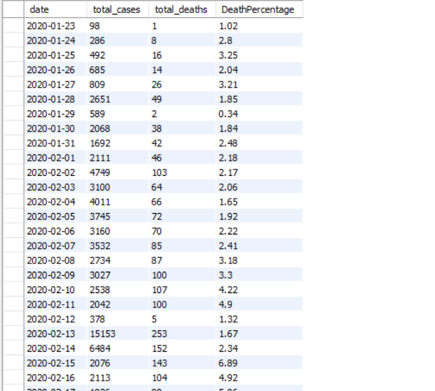
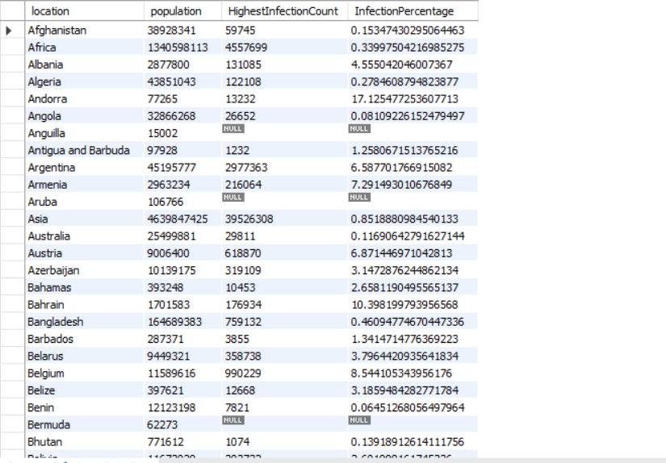
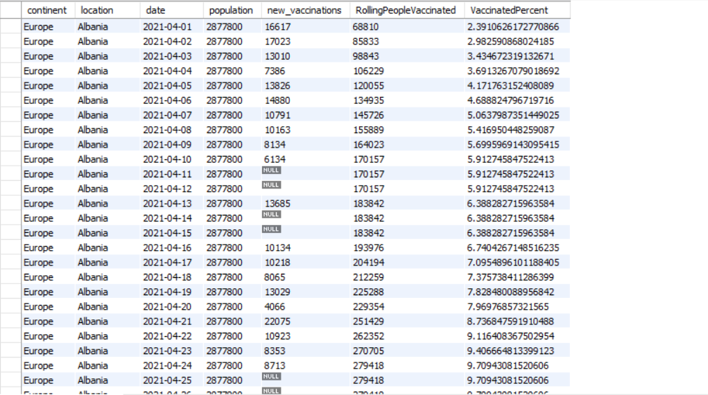
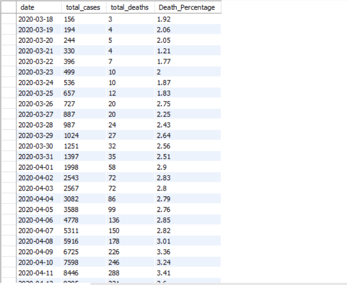
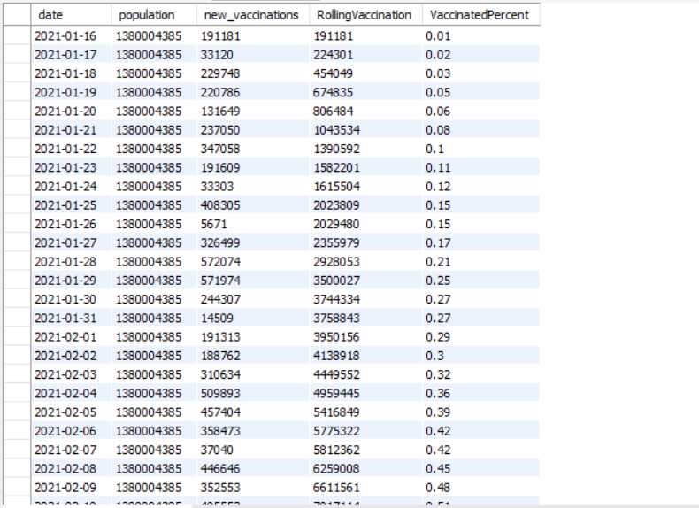
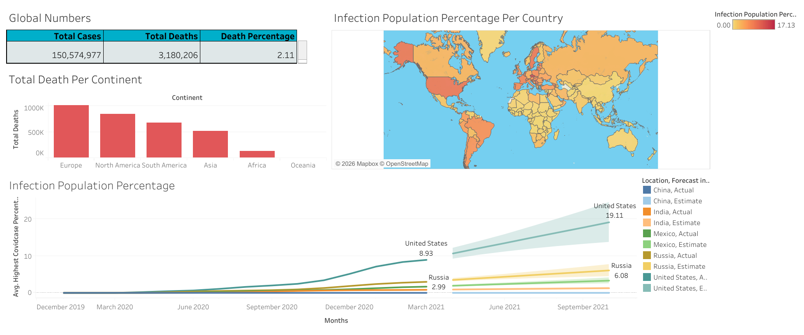

# 📊 COVID-19 Data Analysis using SQL

## 📌 Overview
This project analyzes COVID-19 data using SQL to identify trends in cases, deaths, and vaccinations across countries and over time.

The dataset was cleaned and transformed before performing analysis to ensure accurate and meaningful insights.

---

## 📸 Project Preview

### 🌍 Global Trends


### 🌎 Country-Level Analysis


### 💉 Vaccination Analysis


---

## 🛠 Tools & Technologies
- SQL (MySQL)
- Excel (for initial data handling)
- GitHub (for version control)

---

## 📂 Dataset
- COVID Deaths dataset  
- COVID Vaccinations dataset  

---

## ⚙️ Data Cleaning
- Handled missing values using `NULLIF` and `TRIM`
- Converted data types (VARCHAR → DATE, DOUBLE, BIGINT)
- Resolved import issues by initially storing all columns as VARCHAR
- Performed data transformation for accurate analysis

---

## 🔍 Key Analysis Performed

### 🌍 Global Analysis
- Total cases and deaths over time  
- Daily death percentage  

### 🌎 Country-Level Analysis
- Infection rate compared to population  
- Highest death count by country  

### 🌐 Continent-Level Analysis
- Total deaths by continent  

### 💉 Vaccination Analysis
- Rolling vaccination count using window functions  
- Percentage of population vaccinated  

---

## 🇮🇳 India-Specific Analysis

To provide deeper insights, a focused analysis was performed on India.

### 📊 COVID Trends in India


- Tracked growth of total cases and deaths over time  
- Calculated death percentage to understand severity trends  
- Observed fluctuations in death rate during different phases  

### 💉 Vaccination Progress in India


- Analyzed daily vaccination data  
- Used window functions to calculate rolling vaccination count  
- Measured percentage of population vaccinated over time  

### 📌 Key Insights
- Rapid increase in cases during peak pandemic periods  
- Death percentage remained relatively stable with minor fluctuations  
- Vaccination rollout showed consistent and steady growth  

---

## 🧠 SQL Concepts Used
- Aggregate Functions (SUM, MAX)
- Joins
- Window Functions
- Common Table Expressions (CTE)
- Views for reusable queries
- Data Cleaning techniques

---

## 📁 Project Structure

```
covid19-data-analysis-sql/
│
├── data/
│   ├── covid_deaths.csv
│   └── covid_vaccinations.csv
│
├── sql/
│   ├── 01_data_cleaning.sql
│   ├── 02_analysis_queries.sql
│   └── 03_views.sql
│
├── screenshots/
│   ├── global_stats.png
│   ├── country_analysis.png
│   ├── vaccination_progress.png
│   └── india_analysis.png
│
└── README.md
```

---

## ▶️ How to Run

1. Create a database in MySQL  
2. Run `01_data_cleaning.sql`  
3. Run `02_analysis_queries.sql`  
4. Run `03_views.sql`  

---

## 🚀 Key Learnings
- Handling real-world messy datasets  
- Writing optimized and structured SQL queries  
- Using advanced SQL features like window functions and CTE  
- Designing reusable SQL views for better analysis  

---

## 📊 Interactive Dashboard
An interactive dashboard was built using Tableau to visualize COVID-19 trends.


🔗 View Dashboard:
https://public.tableau.com/app/profile/shahil.srivastav/viz/CovidDashboard_17748679491960/Dashboard1?publish=yes 

---

## 👤 Author
Shahil Srivastav
